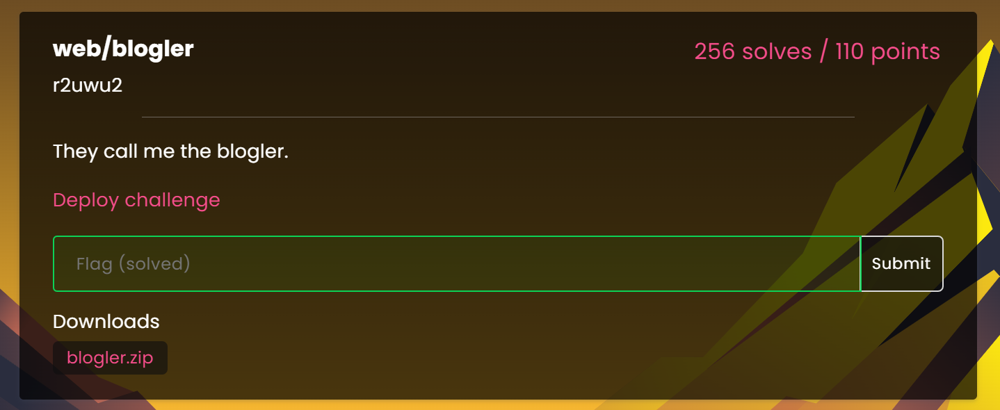
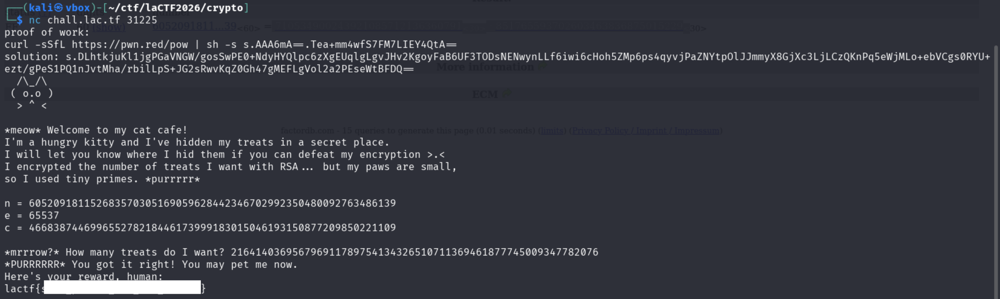
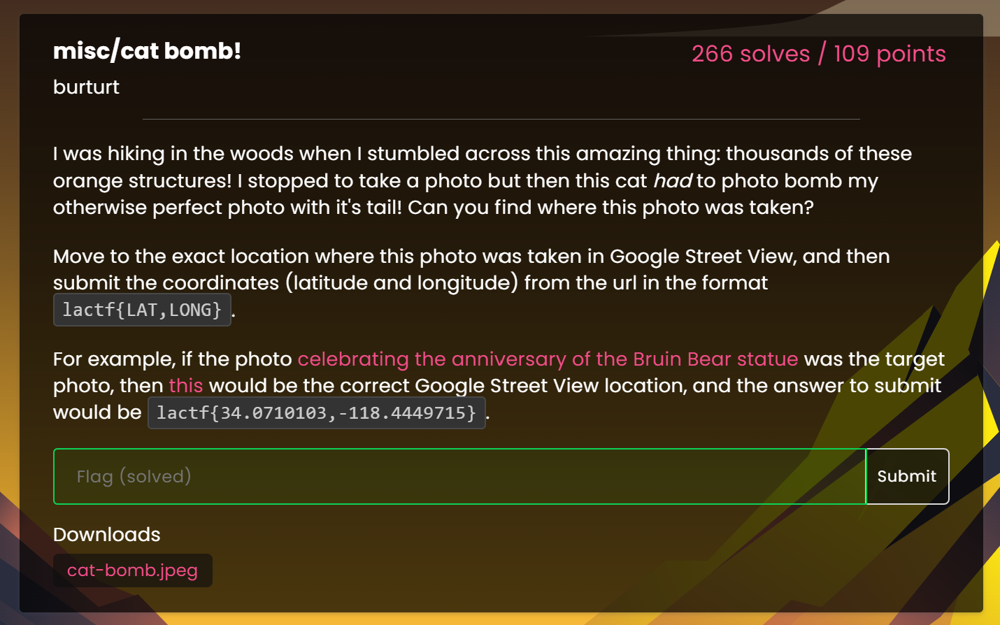

## Web/Blogler


There was a login and register page and after registering a user we get into this web page where we have config editor which seems to take in yaml configuration and another upload blog section.


### Analysing the contents of blogler.zip

```text

.
├── app.py
├── Dockerfile
├── static
│   ├── main.js
│   └── style.css
└── templates
    ├── blog.html
    ├── index.html
    └── login.html

```

The core vulnerability in this challenge lies in a logic flaw within the ```validate_conf``` function combined with the behavior of the ``display_name`` function and ***YAML anchors***.


#### Vulnerability
- LFI Check Bypass: The ```validate_conf``` function attempts to prevent Path Traversal by checking if the string ```../``` exists in the filename and ensuring the resolved path stays within the blogs directory. However, it only validates the state of the configuration at that moment.
- Shared object via YAML Anchors: Using YAML anchors (```&``` and ```*```), we can make a blog entry and the user configuration point to the same dictionary object in memory.
- Bypassing ```display_name()```: The ```display_name``` function capitalizes each part and joins them,  If a part starts with a non-alphabetical character (like ```.``` or ```/```), ```capitalize()``` does nothing. By using a sequence like ```.._/_```, we can construct a path traversal string that doesn't contain the literal ```../``` (thus bypassing the check)

#### Exploit

```yaml
blogs:
  - &exploit
    title: "Flag"
    name: "_.._/_.._/_.._/_.._/_.._/_.._/_./flag"
user: *exploit
```
-  The string ```_.._/_.._/_.._/_.._/_.._/_.._/_./flag``` does not contain ```../```. During validation, pathlib treats the underscores as part of the directory names.
-  Because of the YAML anchor (```&exploit``` and ```*exploit```), the user object and the first blog object are the same dictionary in memory.
- ```display_name()``` function splits by ```_``` into ```['', '..', '/', '..', '/', '..', '/', '..', '/', '..', '/', '..', '/', './flag']```.
- It capitalizes each letter but  ```..```, and ```/``` remain unchanged. ```./flag``` remains ```./flag``` (because it starts with a dot).
It joins them into: ```../../../../../.././flag.```
- And we get the ```flag```

## Crypto/Smol Cats


I was a straight forward challenge gave us ```modulus(n)```, ```cipher(c)``` and ```public exponent(e)``` and we have to decode cipher and give it ```message(m)``` in hex.


I used [factor.db](https://factordb.com) to find the factors of the modulus.

### Solution
- Submit the Proof of work and copy and paste the n, c and e
- calculate factors of n

```python
# copy and paste n,c, e from the instance
n = 605209181152683570305169059628442346702992350480092763486139
e = 65537
c = 466838744699655278218446173999183015046193150877209850221109


# from factordb calculate factors of n
p = 710534900243921085712136360791
q = 851765593702603463836875015229


phi = (p - 1) * (q - 1)
d = pow(e, -1, phi)
m = pow(c, d, n)

print(m)

# output: 216414036956796911789754134326510711369461877745009347782076
# submit this value
```



## Misc/Cat Bomb!


This was an OSINT challenge, we have ```cat-bomb.jpeg``` which shows us the location where photograph was taken.


Using reverse image search we got the location of the image.


Using Google maps to pinpoint the location. After much digging around ```Google Street View``` in Fushimi Inari Shrine, I finally found the exact location


To get the exact digits, the maps has that exact 7 decimal places in the url portion:
```<REDACTED>/@34.9681538,135.7773153<REDACTED>```


